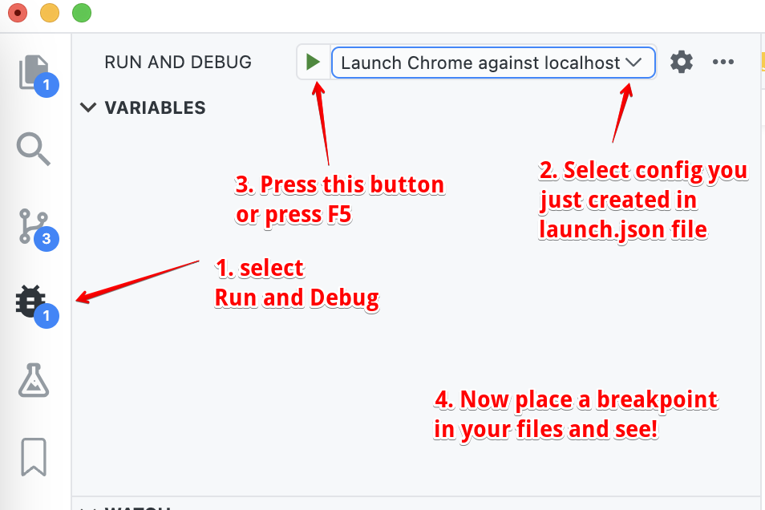

# Liliana Player Admin

Admin portal for Liliana Player. See production here: https://anhtuta.github.io/lili-admin/

## How to run

This project has been developing with Nodejs version 16

### Not using docker: run with local env

- `yarn install`
- `yarn start`
- Open browser and see the result: http://localhost:3006/#/

### Using docker: build and run with production env

- Build image: `docker build -t anhtuta/lili-admin:v1 .`
- Run container: `docker-compose up`
- Open browser and see the result: http://localhost:3006/#/
- Go inside the container and explore by yourself: `docker-compose exec app sh` (note: `app` là tên của service/container ta muốn xem)

Ref: https://viblo.asia/p/dockerize-ung-dung-vuejs-reactjs-ORNZqxwNK0n

### Using docker: run with local env

Cách này giống như chạy lệnh `yarn start` ở local vậy. Ta tạo file `Dockerfile.dev` và file `docker-compose-dev.yml` để thực hiện việc này

- Trong file compose đã chỉ rõ việc build image rồi, nên ko cần chạy `docker build` nữa
- Chỉ cần chạy lệnh sau là được: `docker-compose -f docker-compose-dev.yml up -d`
- Open browser and see the result: http://localhost:3006/#/
- Vào trong container: `docker-compose exec app-dev sh`

Ref:

- https://learn2torials.com/a/dockerize-reactjs-app
- https://github.com/facebook/create-react-app/issues/8688#issuecomment-602110747

## How to debug in VS Code

Nguyên lý debug:

- Start app ở terminal như bình thường
- Sau đó start debugger lắng nghe server vừa start ở trên

Các bước debug:

- Create `launch.json` file, để cho debugger dùng
- Cài extension **Debugger for Chrome** (giờ thay thế bằng JavaScript Debugger), ko biết cái này có sẵn hay tự cài nữa, quên rồi!
- Mở terminal và start app như thường: `yarn start`. Sau khi start xong thì 1 browser sẽ được mở lên. Cái này KHÔNG dùng cho debugger
- Start debugger: ấn F5 hoặc chi tiết thì vào tab debugger và start. Lúc này 1 browser mới sẽ được mở lên, hãy thao tác trên này vì debugger chỉ hoạt động trên này!



## How to build and deploy to a static web server

- `yarn build`
- Copy all static files in `build` folder to your web server

## Code base

This is my code base, includes all of my latest updated common components!

Các components sau thường sẽ dùng chung cho nhiều project, và nếu update chúng ở project khác, thì sẽ cần update ở cả project này nữa:

- src\components\Auth (Sửa API endpoint và 1 vài chỗ nhỏ khác)
- src\components\Button
- src\components\Input
- src\components\Loadable (Cần sửa các page import trong Loadable)
- src\components\Modal
- src\components\Table
- src\components\Toast
- .prettierrc

## Một vài note về code của dự án

### CircleCI

CircleCI dùng để auto build mỗi khi có commit mới nhất được push lên github

Vào đây mà xem: https://app.circleci.com/pipelines/github/anhtuta/liliana-player-admin

Config circleCI ở file `.circleci/config.yml`. Hình như hồi đó lên github config xong nó tự gen ra cái file này hộ, sau đó chỉnh sửa xíu lại là được. Hiện tại thì đang config nếu như có commit push lên nhánh `master` thì mới chạy circleCI.

Sau khi chạy xong thì có file build được nén lại đó. Chẳng hạn, có thể vào đây, sang tab artifacts để download file build về: https://app.circleci.com/pipelines/github/anhtuta/liliana-player-admin/28/workflows/1f8ef2a7-fd0b-49ce-b659-2bd89ddbd1d9/jobs/19/resources

### Set port to run on local

On Windows:

```
"start": "set PORT=3006 && react-scripts start"
```

But when I switch to macOS, I need to change it to:

```
"start": "PORT=3006 react-scripts start"
```

=> Solution: using `cross-env`: https://stackoverflow.com/a/48669909/7688028

```
"start": "cross-env PORT=3006 react-scripts start",
```

---

This project was bootstrapped with [Create React App](https://github.com/facebook/create-react-app).

## Available Scripts

In the project directory, you can run:

### `yarn start`

Runs the app in the development mode.<br />
Open [http://localhost:3006](http://localhost:3006) to view it in the browser.

The page will reload if you make edits.<br />
You will also see any lint errors in the console.

### `yarn test`

Launches the test runner in the interactive watch mode.<br />
See the section about [running tests](https://facebook.github.io/create-react-app/docs/running-tests) for more information.

### `yarn build`

Builds the app for production to the `build` folder.<br />
It correctly bundles React in production mode and optimizes the build for the best performance.

The build is minified and the filenames include the hashes.<br />
Your app is ready to be deployed!

See the section about [deployment](https://facebook.github.io/create-react-app/docs/deployment) for more information.

### `yarn eject`

**Note: this is a one-way operation. Once you `eject`, you can’t go back!**

If you aren’t satisfied with the build tool and configuration choices, you can `eject` at any time. This command will remove the single build dependency from your project.

Instead, it will copy all the configuration files and the transitive dependencies (webpack, Babel, ESLint, etc) right into your project so you have full control over them. All of the commands except `eject` will still work, but they will point to the copied scripts so you can tweak them. At this point you’re on your own.

You don’t have to ever use `eject`. The curated feature set is suitable for small and middle deployments, and you shouldn’t feel obligated to use this feature. However we understand that this tool wouldn’t be useful if you couldn’t customize it when you are ready for it.

## Learn More

You can learn more in the [Create React App documentation](https://facebook.github.io/create-react-app/docs/getting-started).

To learn React, check out the [React documentation](https://reactjs.org/).

### Code Splitting

This section has moved here: https://facebook.github.io/create-react-app/docs/code-splitting

### Analyzing the Bundle Size

This section has moved here: https://facebook.github.io/create-react-app/docs/analyzing-the-bundle-size

### Making a Progressive Web App

This section has moved here: https://facebook.github.io/create-react-app/docs/making-a-progressive-web-app

### Advanced Configuration

This section has moved here: https://facebook.github.io/create-react-app/docs/advanced-configuration

### Deployment

This section has moved here: https://facebook.github.io/create-react-app/docs/deployment

### `yarn build` fails to minify

This section has moved here: https://facebook.github.io/create-react-app/docs/troubleshooting#npm-run-build-fails-to-minify
